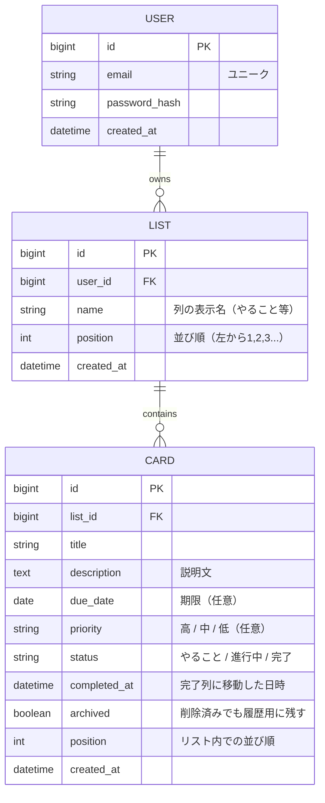
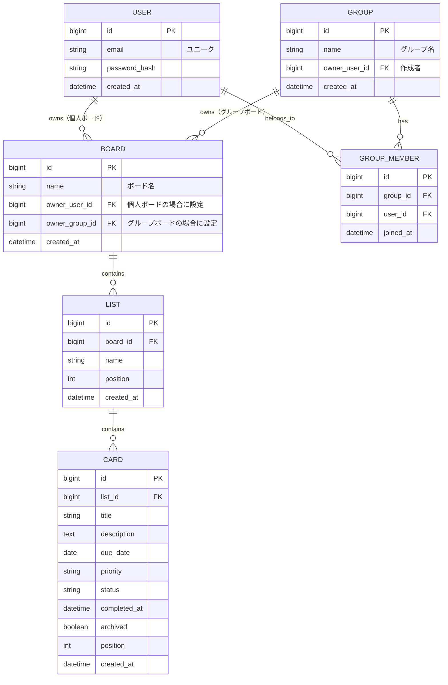

# データモデル：データ項目（CARD以外）とER図（詳細）

[← 要件定義書に戻る](../requirements.md)

タスクカード（CARD）のデータ項目は本書（要件定義書 9.1）に残っており、本ファイルにはそれ以外のエンティティのデータ項目とER図をまとめる。

## データ項目（CARD以外）

### リスト（LIST）

カンバンの列を表すエンティティ。フェーズ1〜4ではユーザーに紐付き、フェーズ5以降はボードに紐付く。

| 項目 | 型 | 必須 | 備考 |
|------|----|----|------|
| ID | 文字列 | ○ | 一意の識別子 |
| ユーザーID | 数値 | △ | フェーズ3〜4で必須。フェーズ5ではボードIDに置き換わる |
| ボードID | 数値 | △ | フェーズ5以降で必須 |
| 列名 | 文字列 | ○ | 列の表示名（やること／進行中／完了／ユーザー追加列） |
| 並び順 | 数値 | ○ | 左から1, 2, 3... の順序 |

### ユーザー（USER）

フェーズ3で導入。

| 項目 | 型 | 必須 | 備考 |
|------|----|----|------|
| ID | 数値 | ○ | 一意の識別子 |
| メールアドレス | 文字列 | ○ | ユニーク。ログインIDとして使用 |
| パスワード（ハッシュ） | 文字列 | ○ | 平文保存しない（ハッシュ化して保存） |
| 作成日時 | 日時 | ○ | アカウント登録日時 |

### ボード（BOARD）

フェーズ5で導入。個人ボードまたはグループボードのいずれかとして作成される。

| 項目 | 型 | 必須 | 備考 |
|------|----|----|------|
| ID | 数値 | ○ | 一意の識別子 |
| ボード名 | 文字列 | ○ | ボードの表示名 |
| 所有ユーザーID | 数値 | △ | 個人ボードの場合に設定（グループボードでは空） |
| 所有グループID | 数値 | △ | グループボードの場合に設定（個人ボードでは空） |
| 作成日時 | 日時 | ○ | ボード作成日時 |

※ 所有ユーザーIDと所有グループIDはどちらか一方のみ設定される（排他）

### グループ（GROUP）

フェーズ5で導入。

| 項目 | 型 | 必須 | 備考 |
|------|----|----|------|
| ID | 数値 | ○ | 一意の識別子 |
| グループ名 | 文字列 | ○ | グループの表示名 |
| 作成者ユーザーID | 数値 | ○ | グループを作成したユーザー |
| 作成日時 | 日時 | ○ | グループ作成日時 |

### グループメンバー（GROUP_MEMBER）

フェーズ5で導入。ユーザーとグループの所属関係（多対多）を表す中間テーブル。

| 項目 | 型 | 必須 | 備考 |
|------|----|----|------|
| ID | 数値 | ○ | 一意の識別子 |
| グループID | 数値 | ○ | 所属先のグループ |
| ユーザーID | 数値 | ○ | 所属するユーザー |
| 参加日時 | 日時 | ○ | グループに参加した日時 |

---

## ER図

### フェーズ1〜4（個人利用）

個人利用が前提のため、ユーザーは自分専用のリスト（列）とカードを保有する。

**補足：**
- USER はフェーズ3以降で導入される。フェーズ1〜2では認証を持たないため、LIST と CARD のみがブラウザの localStorage に保存される
- CARD.completed_at は完了タスク一覧画面（S-05）で完了日順ソートと履歴検索の根拠データとなる
- CARD.archived = true のレコードはボード画面には表示されず、完了タスク一覧画面でのみ参照される

### フェーズ5（基本機能：ボード概念の導入）

個人用ボードとグループ用ボードを共存させるため、BOARD エンティティを新規導入する。
LIST は USER ではなく BOARD に紐付く形に変更し、BOARD の所有者は個人ユーザーまたはグループのいずれかとする。

**補足：**
- BOARD.owner_user_id と BOARD.owner_group_id はどちらか一方のみ値を持つ（排他制約）。個人ボードかグループボードかを区別する
- フェーズ4から移行する際は、各ユーザーに「個人ボード」を1つ自動生成し、既存の LIST.user_id を LIST.board_id へ付け替える移行処理が必要となる
- 担当者割当・リーダー権限・提案フロー・通知などは将来検討事項（要件定義書 5.5.1 参照）であり、本ER図には含めていない
