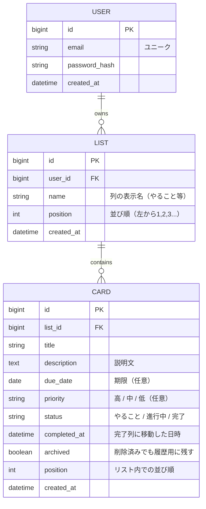

# データモデル：データ項目（CARD以外）とER図（詳細）

[← 要件定義書に戻る](../requirements.md)

タスクカード（CARD）のデータ項目は本書（要件定義書 9.1）に残っており、本ファイルにはそれ以外のエンティティのデータ項目とER図をまとめる。

## データ項目（CARD以外）

### リスト（LIST）

カンバンの列を表すエンティティ。フェーズ1〜4ではユーザーに紐付く。

| 項目 | 型 | 必須 | 備考 |
|------|----|----|------|
| ID | 文字列 | ○ | 一意の識別子 |
| ユーザーID | 数値 | ○ | フェーズ3以降で必須（フェーズ1〜2は認証なし） |
| 列名 | 文字列 | ○ | 列の表示名（やること／進行中／完了／ユーザー追加列） |
| 並び順 | 数値 | ○ | 左から1, 2, 3... の順序 |

※ フェーズ5ではグループ所有 LIST を扱うため `グループID` カラムが追加される（詳細は [`../requirements_phase5.md`](../requirements_phase5.md) 参照）。

### ユーザー（USER）

フェーズ3で導入。

| 項目 | 型 | 必須 | 備考 |
|------|----|----|------|
| ID | 数値 | ○ | 一意の識別子 |
| メールアドレス | 文字列 | ○ | ユニーク。ログインIDとして使用 |
| パスワード（ハッシュ） | 文字列 | ○ | 平文保存しない（ハッシュ化して保存） |
| 作成日時 | 日時 | ○ | アカウント登録日時 |

---

## ER図

### フェーズ1〜4（個人利用）

個人利用が前提のため、ユーザーは自分専用のリスト（列）とカードを保有する。

**補足：**
- USER はフェーズ3以降で導入される。フェーズ1〜2では認証を持たないため、LIST と CARD のみがブラウザの localStorage に保存される
- CARD.completed_at は完了タスク一覧画面（S-05）で完了日順ソートと履歴検索の根拠データとなる
- CARD.archived = true のレコードはボード画面には表示されず、完了タスク一覧画面でのみ参照される

### フェーズ5（将来：グループ機能）

フェーズ5の ER 図と GROUP / GROUP_MEMBER などのデータ項目は別ファイル [`../requirements_phase5.md`](../requirements_phase5.md) を参照。
