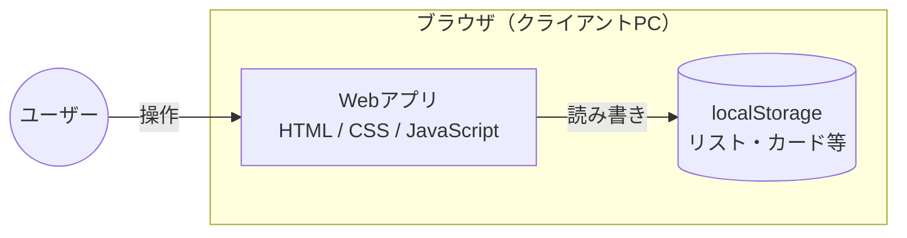
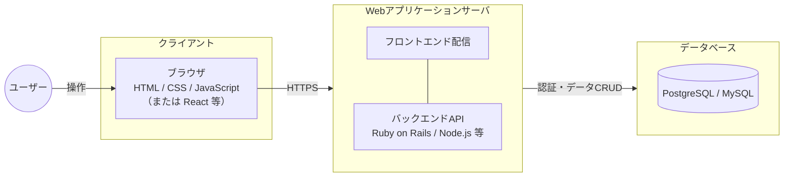

# システム構成図（詳細）

[← 要件定義書に戻る](../requirements.md)

## フェーズ1〜2（ブラウザ単独構成）

ブラウザ上のみで動作し、データはブラウザの localStorage に保存される。サーバや外部通信は発生しない。

**補足：**
- データはブラウザごと・端末ごとに保存されるため、別端末への持ち出しはできない
- 認証は持たず、ブラウザを開けば即座にボード画面に到達する

## フェーズ3以降（Web3層構成）

フロントエンド／バックエンド／データベースの3層構成に移行する。ユーザー認証とサーバー側データ保存により、複数端末からのアクセスが可能になる。

**補足：**
- フェーズ5でグループ・ボード機能を導入する際もこの3層構成は変わらず、データベース内のテーブル構成のみ変更される（[`data-model.md`](data-model.md) のフェーズ5 ER図 参照）
- 将来的に通知機能や提案フローを追加する際は、メール送信サービスや非同期ジョブ基盤などの外部要素が加わる可能性がある（要件定義書 5.5.1 将来検討事項 参照）
- ホスティング先（クラウドサービス）や具体的なミドルウェアはスクール教材に合わせて選定する
