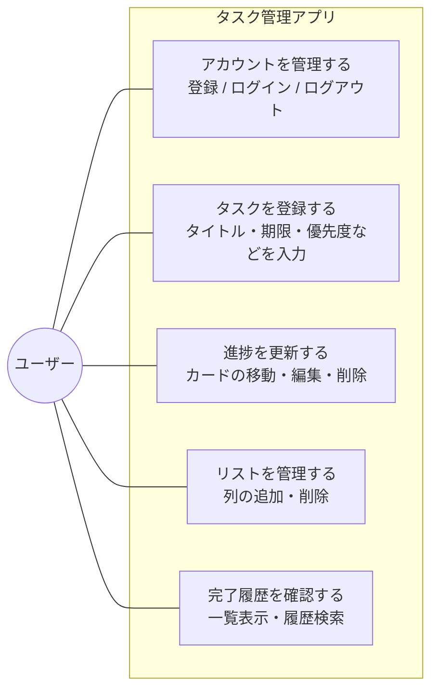
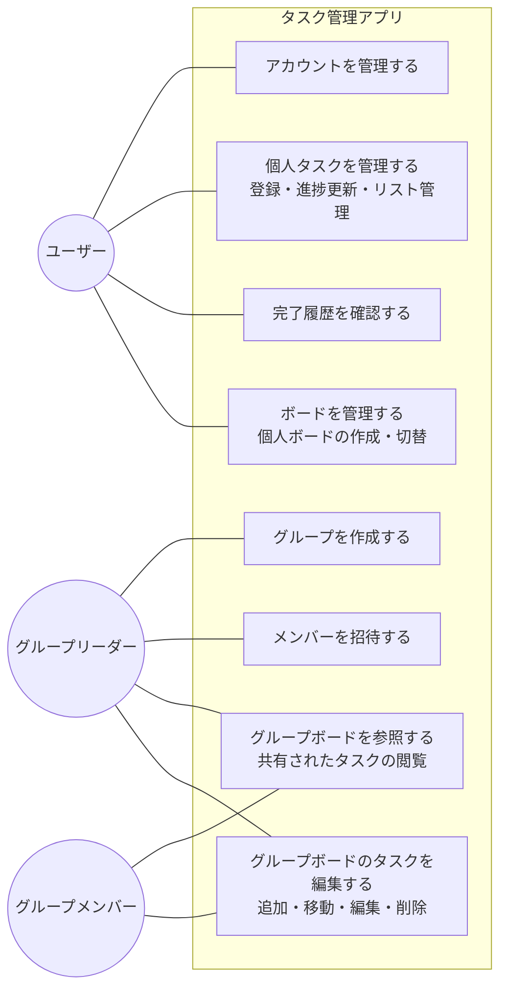

# ユースケース図・記述（詳細）

[← 要件定義書に戻る](../requirements.md)

## ユースケース図

業務単位で「誰が何をするか」を示す図。Mermaidには正式なユースケース図記法がないため、`flowchart` でアクター（楕円）とユースケース（矩形）、システム境界（subgraph）を擬似的に表現する。

### フェーズ1〜4（個人利用）

**補足：**
- フェーズ1〜2では「アカウントを管理する」（UC1）は対象外。ブラウザ上で直接タスク管理を行う
- フェーズ3で UC1 が追加される
- フェーズ4で UC5「完了履歴を確認する」のうち履歴検索機能が利用可能になる

### フェーズ5（基本機能：ボード／グループ機能を含む）

フェーズ5では「グループメンバー」「グループリーダー」がアクターとして加わる。グループリーダーはグループメンバーを兼ねる関係（Leader is-a Member）にある。

**補足：**
- ユーザー（U）はログイン直後の基本アクター。グループに参加すると「グループメンバー（M）」として、グループを作成すると「グループリーダー（L）」として振る舞う
- グループの作成・メンバー招待はリーダーのみが実行できる
- グループボードの参照・編集はメンバー／リーダーいずれも実行できる（編集権限の細分化は将来検討事項）

---

## ユースケース記述

ユースケース図に登場した各ユースケースを、標準形式（ユースケース名／アクター／概要／事前条件／事後条件／基本フロー／代替フロー）で記述する。

### UC-01 アカウントを管理する（フェーズ3〜）

| 項目 | 内容 |
|------|------|
| アクター | ユーザー |
| 概要 | メールアドレスとパスワードでアカウントを登録し、ログイン／ログアウトを行う |
| 事前条件 | アプリにアクセスできる |
| 事後条件 | ログイン状態でボード画面が表示される、または未ログイン状態に戻る |

**基本フロー（新規登録 → ログイン → ログアウト）**
1. ユーザーがログイン画面（S-04）を開く
2. 「新規登録はこちら」リンクからユーザー登録画面（S-03）へ遷移
3. メールアドレス・パスワード・パスワード（確認）を入力し「登録」ボタンを押す
4. システムが入力内容を検証し、ユーザーを登録、ログイン画面へ戻す
5. ユーザーがメールアドレスとパスワードを入力し「ログイン」ボタンを押す
6. システムが認証し、ボード画面（S-01）を表示する
7. ヘッダーの「ログアウト」ボタンを押すとセッションを終了し、ログイン画面に戻る

**代替フロー**
- A1. メールアドレスが既に登録されている：エラーを表示し、再入力を促す
- A2. パスワード（確認）が一致しない：エラーを表示し、再入力を促す
- A3. ログイン情報が誤っている：認証エラーを表示し、再入力を促す

---

### UC-02 タスクを登録する（フェーズ1〜）

| 項目 | 内容 |
|------|------|
| アクター | ユーザー |
| 概要 | 新しいタスクをカードとして「やること」列に追加する |
| 事前条件 | ボード画面が表示されている（フェーズ3以降はログイン済み） |
| 事後条件 | 「やること」列に新規カードが追加されている |

**基本フロー**
1. ユーザーが「やること」列の「+ カード追加」ボタンを押す
2. カード詳細モーダル（S-02）が開く
3. ユーザーがタイトル（必須）、説明文・期限・優先度（任意）を入力する
4. 「保存」ボタンを押す
5. システムがカードを保存し、モーダルを閉じる
6. 「やること」列の末尾に新規カードが表示される

**代替フロー**
- A1. タイトル未入力で保存：必須エラーを表示し、保存しない
- A2. 「キャンセル」または × ボタンで閉じる：保存せずモーダルを閉じる

---

### UC-03 進捗を更新する（フェーズ1〜）

| 項目 | 内容 |
|------|------|
| アクター | ユーザー |
| 概要 | カードの状態（列）を移動したり、内容を編集したり、不要なカードを削除する |
| 事前条件 | ボード画面に対象カードが表示されている |
| 事後条件 | カードの状態・内容が更新されている、または削除（アーカイブ）されている |

**基本フロー（移動）**
1. ユーザーがカードをドラッグして別の列にドロップする（フェーズ2〜）
2. システムがカードの状態を更新する
3. 「完了」列にドロップした場合、システムが完了日時を自動記録する

**基本フロー（編集）**
1. ユーザーがカードをクリックする
2. カード詳細モーダル（S-02）が開き、現在の内容が表示される
3. ユーザーが内容を編集して「保存」ボタンを押す
4. システムが内容を更新し、モーダルを閉じる

**基本フロー（削除）**
1. ユーザーがカード詳細モーダルで「削除」ボタンを押す
2. システムが確認ダイアログを表示する
3. ユーザーが確認すると、カードはアーカイブ済み（archived=true）として保存され、ボード画面から非表示になる

**代替フロー**
- A1. ドラッグ&ドロップ未対応のフェーズ1：状態変更ボタン等の代替UIを使用する
- A2. 編集中に「キャンセル」：変更を破棄してモーダルを閉じる
- A3. 削除確認でキャンセル：削除を取りやめる

---

### UC-04 リストを管理する（フェーズ2〜）

| 項目 | 内容 |
|------|------|
| アクター | ユーザー |
| 概要 | カンバンの列(リスト)を任意に追加・削除する |
| 事前条件 | ボード画面が表示されている |
| 事後条件 | リストが追加または削除されている |

**基本フロー（追加）**
1. ユーザーがフッターの「+ リスト追加」ボタンを押す
2. リスト名を入力するダイアログが表示される
3. ユーザーがリスト名を入力して確定する
4. システムが新しいリストを末尾に追加する

**基本フロー（削除）**
1. ユーザーがリストヘッダーの削除アイコンを押す
2. システムが確認ダイアログを表示する（含まれるカードがある場合は警告）
3. ユーザーが確認するとリストが削除される

**代替フロー**
- A1. 削除しようとしたリストにカードが残っている：警告を表示し、カードの扱い（一括削除／別リストへ移動）を選ばせる
- A2. リスト名未入力：必須エラーを表示する

---

### UC-05 完了履歴を確認する（フェーズ4〜）

| 項目 | 内容 |
|------|------|
| アクター | ユーザー |
| 概要 | 過去に完了したタスクを一覧で確認し、必要に応じて履歴検索で絞り込む |
| 事前条件 | ボード画面が表示されている |
| 事後条件 | 完了タスク一覧が表示される（必要に応じて検索結果に絞り込まれている） |

**基本フロー**
1. ユーザーがボード画面フッターの「完了タスク一覧へ」ボタンを押す
2. 完了タスク一覧画面（S-05）が表示される
3. システムが完了タスクを完了日が新しい順で一覧表示する（タイトル／完了日／説明文先頭1〜2行）
4. ユーザーが必要に応じて履歴検索エリアにキーワード（タイトル欄→タイトルのみ照合／説明文欄→説明文のみ照合・各欄に空白区切りで複数ワード可）を入力し、「検索」ボタンを押す
5. システムが OR 条件で絞り込んだ結果を一覧に表示する（大文字小文字・全角半角を区別せず、いずれかのワードが該当フィールドに含まれるカードを表示）
6. ユーザーが任意の行をクリックすると、カード詳細モーダル（S-02）で全文を確認できる
7. フッターの「戻る」ボタンでボード画面に戻る

**代替フロー**
- A1. 完了タスクが0件：「完了タスクはありません」と表示する
- A2. 検索結果が0件：「該当するタスクはありません」と表示する

---

### UC-06 ボードを管理する（フェーズ5）

| 項目 | 内容 |
|------|------|
| アクター | ユーザー |
| 概要 | 個人ボードまたはグループボードを作成し、表示するボードを切り替える |
| 事前条件 | ログイン済み |
| 事後条件 | 選択したボードが表示されている |

**基本フロー**
1. ユーザーがボード切替UI（メニュー等）から「新規ボード作成」を選ぶ
2. ボード名と種別（個人／グループ）を入力する
3. グループを選択した場合、対象グループを指定する
4. システムが新しいボードを作成し、所有者（ユーザーまたはグループ）を設定する
5. 作成されたボードに切り替わって表示される

**代替フロー**
- A1. ボード名未入力：必須エラーを表示する
- A2. グループ未所属でグループボード作成を試行：先にグループ作成が必要である旨のエラーを表示する

---

### UC-07 グループを作成する（フェーズ5）

| 項目 | 内容 |
|------|------|
| アクター | グループリーダー（作成時点でリーダーになるユーザー） |
| 概要 | 複数ユーザーでボードを共有するためのグループを作成する |
| 事前条件 | ログイン済み |
| 事後条件 | 新しいグループが作成され、作成者がリーダーとして登録されている |

**基本フロー**
1. ユーザーがグループ管理画面（S-06）を開く
2. 「新規グループ作成」ボタンを押す
3. グループ名を入力する
4. システムがグループを作成し、作成者を `owner_user_id` として登録する
5. 作成者が自動的にグループメンバーとして登録される

**代替フロー**
- A1. グループ名未入力：必須エラーを表示する
- A2. 同名グループが既に存在する場合：警告を表示するが作成は許可する（運用上はユニーク制約を設けない想定）

---

### UC-08 メンバーを招待する（フェーズ5）

| 項目 | 内容 |
|------|------|
| アクター | グループリーダー |
| 概要 | 既存ユーザーをグループメンバーとして招待する |
| 事前条件 | リーダーがそのグループを所有している |
| 事後条件 | 招待されたユーザーがグループメンバーとして登録されている |

**基本フロー**
1. リーダーがグループ管理画面で対象グループを開く
2. 「メンバーを招待」ボタンを押す
3. 招待したいユーザーのメールアドレスを入力する
4. システムが該当ユーザーを検索し、グループメンバーとして登録する
5. 招待されたユーザーは次回ログイン時にグループボードを参照できるようになる

**代替フロー**
- A1. 入力したメールアドレスのユーザーが存在しない：エラーを表示する
- A2. 既にメンバーである：「すでにメンバーです」と表示する

---

### UC-09 グループボードを参照する（フェーズ5）

| 項目 | 内容 |
|------|------|
| アクター | グループメンバー、グループリーダー |
| 概要 | 自分が所属するグループのボードを表示し、共有されているタスクを閲覧する |
| 事前条件 | グループに所属している |
| 事後条件 | グループボードのカード一覧が表示される |

**基本フロー**
1. ユーザーがボード切替UIから所属するグループのボードを選ぶ
2. システムが該当ボードのリスト・カードを取得して表示する
3. ユーザーがカードをクリックすると、詳細モーダル（S-02）で内容を確認できる

**代替フロー**
- A1. グループから既に外されている：「ボードへのアクセス権がありません」と表示する

---

### UC-10 グループボードのタスクを編集する（フェーズ5）

| 項目 | 内容 |
|------|------|
| アクター | グループメンバー、グループリーダー |
| 概要 | グループボード上のカードを追加・移動・編集・削除する |
| 事前条件 | グループメンバーとしてグループボードを開いている |
| 事後条件 | グループボードのカード状態が更新されている |

**基本フロー**
1. メンバーが UC-02（タスク登録）／UC-03（進捗更新）と同様の操作を行う
2. システムは変更を該当グループボードに対して保存する
3. 同じグループの他メンバーが次回参照したときに、変更が反映された状態で表示される

**代替フロー**
- A1. 編集権限の細分化（リーダーのみ編集可など）は将来検討事項であり、現スコープでは全メンバーに編集を許可する
- A2. 同時編集による競合：最終保存が優先される（楽観的ロック方式は将来検討事項）
