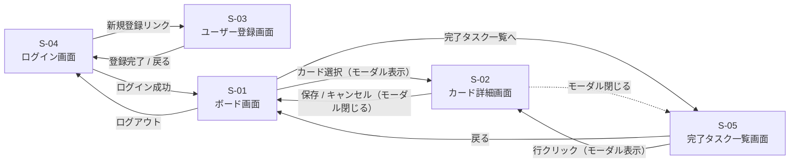
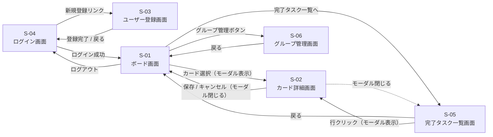
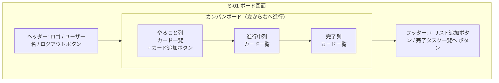
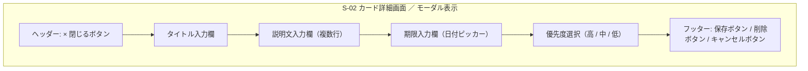
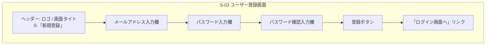
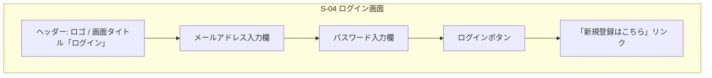
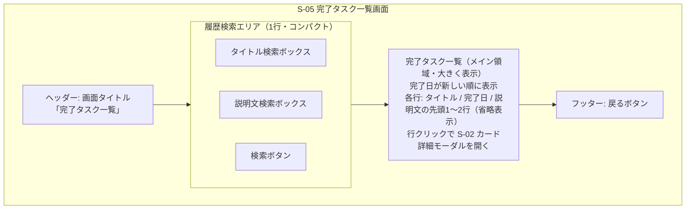

# タスク管理アプリ 要件定義書

## 1. プロジェクト概要

### 1.1 アプリ名
TaskManagement（仮称）

### 1.2 目的
個人のタスクを視覚的に管理し、進捗状況を一目で把握できるようにする。
将来的にはグループでのタスク共有を可能にし、チームでの作業管理にも対応する。

### 1.3 背景
- 日々のタスクを整理し、やるべきことを見える化したい
- Trello風のカンバン方式で直感的に操作できるアプリを自作することで、Web開発の基礎を学ぶ

---

## 2. プロジェクト体制・前提条件

> ※ 本プロジェクトはスクール課題として個人で開発する学習用プロジェクトです。発注者・契約・検収に関する事項は対象外とします。

### 2.1 開発体制
- 個人開発（要件定義・設計・実装・テスト・ドキュメント作成までを1名で担当）

### 2.2 成果物

| No. | 成果物 | 形式 |
|-----|--------|------|
| 1 | ソースコード一式 | GitHub リポジトリ |
| 2 | 要件定義書（本書） | Markdown |
| 3 | README（環境構築手順） | Markdown |

### 2.3 開発環境

| 項目 | 内容 |
|------|------|
| OS | Windows 11 |
| エディタ | Visual Studio Code |
| バージョン管理 | Git / GitHub |
| 動作確認ブラウザ | Google Chrome / Microsoft Edge（いずれも最新版） |

### 2.4 前提条件

- 本要件定義書に記載のない機能・画面は開発スコープ外とする
- フェーズ単位で段階的に実装し、各フェーズの完了をもって動作確認する
- 利用する第三者ライブラリ・OSS は各ライセンスに従って使用する

---

## 3. 想定ユーザー

### 3.1 初期段階（フェーズ1〜4）
- 自分自身のタスクを管理したい個人ユーザー

### 3.2 将来段階（フェーズ5）
- グループ・チームでタスクを共有したいユーザー

---

## 4. 業務要件

### 4.1 業務概要
本アプリのユーザーは、日常的に発生するタスクを「登録 → 着手 → 完了」という基本サイクルで管理する。アプリは各ステップで必要な情報の保存・表示を担い、ユーザーが進捗を一目で把握できるよう支援する。また、業務終了後に必要に応じて過去の完了タスクを履歴確認できる。

### 4.2 業務フロー図

対象範囲：フェーズ4までの個人利用シーン（ログイン〜タスク完了〜履歴振り返り）。

#### 4.2.1 メイン業務サイクル

タスクの発生から完了までの基本的な業務の流れ。

#### 4.2.2 任意の付随作業（履歴確認）

メイン業務サイクルの終了後、必要に応じて実施する任意の作業。
過去に完了したタスクの事実を後から思い出す／確認するために行う。

### 4.3 補足
- フェーズ1〜2では「ログイン」を伴わず、ブラウザ上で直接ボード画面に到達する
- フェーズ5（将来）では、上記フローに加えて「グループメンバーへ共有」「他メンバーが編集」というステップが追加される

---

## 5. 機能要件

### 5.1 フェーズ1: MVP（最小限の機能）
| ID | 機能名 | 概要 |
|----|--------|------|
| F-01 | カード追加 | タスクをカードとして追加できる |
| F-02 | カード表示 | 追加したカードが画面上に表示される |
| F-03 | カード移動 | 「やること」「進行中」「完了」の列間を移動できる |
| F-04 | カード削除 | 不要になったカードを削除できる |

### 5.2 フェーズ2: 基本機能の拡張
| ID | 機能名 | 概要 |
|----|--------|------|
| F-05 | カードタイトル編集 | カードのタイトルを後から変更できる |
| F-06 | カード説明文 | カードに詳細な説明文を追加できる |
| F-07 | 期限設定 | カードに期限（日付）を設定できる |
| F-08 | データ保存 | ブラウザを閉じてもデータが残る |
| F-09 | ドラッグ&ドロップ | カードをマウス操作で移動できる |
| F-10 | リスト追加・削除 | 列（リスト）を任意に追加・削除できる |
| F-11 | 完了タスクのアーカイブ | 「完了」列に移動した時点で完了日を記録し、削除しても履歴データとして保存される |

### 5.3 フェーズ3: ユーザー機能
| ID | 機能名 | 概要 |
|----|--------|------|
| F-12 | ユーザー登録 | メールアドレスとパスワードで新規登録できる |
| F-13 | ログイン | 登録済みユーザーがログインできる |
| F-14 | ログアウト | ログイン中のユーザーがログアウトできる |

### 5.4 フェーズ4: 便利機能の追加
| ID | 機能名 | 概要 |
|----|--------|------|
| F-15 | 優先度設定 | カードに優先度（高・中・低）を設定できる |
| F-16 | 並び替え | カードを期限・優先度・タイトル順で並び替えできる |
| F-17 | 期限警告色 | 期限が近づくにつれカードの色が段階的に赤くなる |
| F-18 | 履歴検索 | 過去の完了タスクをタイトルと説明文のAND条件で検索できる |

### 5.5 フェーズ5: 将来の拡張
| ID | 機能名 | 概要 |
|----|--------|------|
| F-19 | グループ作成 | 複数ユーザーでタスクを共有するグループを作成できる |
| F-20 | メンバー招待 | グループに他ユーザーを招待できる |
| F-21 | タスク共有 | グループ内でカードを共有・編集できる |

---

## 6. 非機能要件

### 6.1 パフォーマンス
- 主要な画面が3秒以内に表示されること

### 6.2 セキュリティ
- パスワードは平文で保存しない（ハッシュ化）
- ログイン情報は他ユーザーから参照できない

### 6.3 対応ブラウザ
- Google Chrome（最新版）
- Microsoft Edge（最新版）

### 6.4 デバイス
- PC（デスクトップ・ノートPC）を主対象
- スマートフォン対応は将来検討

### 6.5 ユーザビリティ
- 初見のユーザーがマニュアルなしで操作できるシンプルなUI

---

## 7. 画面構成

### 7.1 画面一覧

| 画面ID | 画面名 | 概要 | フェーズ |
|--------|--------|------|---------|
| S-01 | ボード画面 | タスクカードを一覧表示する画面 | 1 |
| S-02 | カード詳細画面 | カードの編集・詳細表示画面（ボード画面上にモーダルで重ねて表示） | 2 |
| S-03 | ユーザー登録画面 | 新規登録フォーム | 3 |
| S-04 | ログイン画面 | ログインフォーム | 3 |
| S-05 | 完了タスク一覧画面 | 完了タスクの一覧表示と履歴検索を行う画面 | 4 |
| S-06 | グループ管理画面 | グループの作成・管理画面 | 5 |

### 7.2 画面遷移図

#### 7.2.1 フェーズ1〜4（個人利用）

ログイン画面を起点とし、認証後にボード画面を中心としたタスク管理画面群へ遷移する。

**補足：**
- フェーズ1〜2は認証機能がないため、起点はボード画面（S-01）となり、S-03/S-04 は存在しない
- フェーズ3でログイン・ユーザー登録・ログアウトの遷移が追加される
- フェーズ4で履歴検索画面（S-05）への遷移が追加される

#### 7.2.2 フェーズ5（将来：グループ機能）

フェーズ5ではボード画面からグループ管理画面（S-06）への遷移が追加される。

### 7.3 画面ワイヤーフレーム

各画面の要素配置（ブロック構造）を Mermaid で示す。実際のレイアウト（余白・サイズ・色）は別途デザインで決定する。

#### 7.3.1 S-01 ボード画面

#### 7.3.2 S-02 カード詳細画面（モーダル）

ボード画面のカードをクリックすると、ボード画面の上に重ねてモーダル表示される。背景はオーバーレイで暗くする想定。

#### 7.3.3 S-03 ユーザー登録画面

#### 7.3.4 S-04 ログイン画面

#### 7.3.5 S-05 完了タスク一覧画面

画面を開いた時点では、完了したタスクを **完了日が新しい順（最新順）** で一覧表示する。
画面上部に1行分の履歴検索エリアを配置し、キーワードを入力すると一覧が検索結果に絞り込まれる。
画面の大部分は完了タスク一覧の表示領域として使い、戻るボタンはフッターに配置する。

各タスクは **タイトル・完了日・説明文（先頭1〜2行のみ省略表示）** を一覧に表示する。
直感的に完了タスクの内容が把握できることを目的とし、行をクリックすると S-02 カード詳細画面（モーダル）が開いて説明文の全文を確認できる。

---

## 8. 使用技術（技術スタック）

### 8.1 フェーズ1〜2、4
- **HTML / CSS / JavaScript**（フロントエンドのみ）
- **localStorage**（ブラウザ内データ保存）

### 8.2 フェーズ3以降
- **フロントエンド**: HTML / CSS / JavaScript（または React 等のフレームワーク）
- **バックエンド**: 未定（Ruby on Rails / Node.js などスクール教材に合わせる）
- **データベース**: 未定（PostgreSQL / MySQL など）
- **認証**: メール+パスワード認証

### 8.3 開発・管理ツール
- **バージョン管理**: Git / GitHub
- **エディタ**: Visual Studio Code

---

## 9. データ仕様（補足）

### 9.1 タスクカードのデータ項目
| 項目 | 型 | 必須 | 備考 |
|------|----|----|------|
| ID | 文字列 | ○ | 一意の識別子 |
| タイトル | 文字列 | ○ | カードの見出し |
| 説明文 | 文字列 | × | 詳細メモ |
| 期限 | 日付 | × | 締め切り日 |
| 優先度 | 列挙（高・中・低） | × | 並び替え・表示用 |
| 状態 | 列挙（やること・進行中・完了） | ○ | 所属する列 |
| 完了日 | 日付 | × | 完了列に移動した日付を記録 |
| アーカイブ済み | 真偽値 | ○ | 削除済みかどうか |

---

## 10. 開発スケジュール（目安）

| フェーズ | 内容 | 目安期間 |
|---------|------|---------|
| フェーズ1 | MVP実装 | 1〜2週間 |
| フェーズ2 | 基本機能拡張 | 2〜3週間 |
| フェーズ3 | ユーザー機能（バックエンド学習含む） | 3〜4週間 |
| フェーズ4 | 便利機能追加 | 2週間 |
| フェーズ5 | グループ機能 | 未定 |

---

## 11. 改訂履歴

| 日付 | 版 | 内容 |
|------|----|----|
| 2026-05-05 | 1.0 | 初版作成 |
| 2026-05-06 | 1.1 | プロジェクト体制・前提条件（第2章）を追加、章番号を再採番 |
| 2026-05-07 | 1.2 | 業務要件（第4章）を追加、業務フロー図を Mermaid で記載 |
| 2026-05-07 | 1.3 | 画面遷移図（第7章 7.2）を追加（フェーズ1〜4および将来のフェーズ5） |
| 2026-05-08 | 1.4 | 画面ワイヤーフレーム（第7章 7.3）を追加。S-05を「完了タスク一覧画面」に改称し履歴検索機能を内包。ボード画面フッターに「完了タスク一覧へ」ボタン追加。S-02はモーダル表示に変更。 |
| 2026-05-08 | 1.5 | S-05 完了タスク一覧の各行に説明文の先頭1〜2行を省略表示する仕様を追記。行クリックで S-02 カード詳細モーダルを開く遷移を画面遷移図にも反映。 |
