# タスク管理アプリ 要件定義書

## 1. プロジェクト概要

### 1.1 アプリ名
TaskManagement（仮称）

### 1.2 目的
個人のタスクを視覚的に管理し、進捗状況を一目で把握できるようにする。
将来的にはグループでのタスク共有を可能にし、チームでの作業管理にも対応する。

### 1.3 背景
- 日々のタスクを整理し、やるべきことを見える化したい
- Trello風のカンバン方式で直感的に操作できるアプリを自作することで、Web開発の基礎を学ぶ

---

## 2. プロジェクト体制・前提条件

> ※ 本プロジェクトはスクール課題として個人で開発する学習用プロジェクトです。発注者・契約・検収に関する事項は対象外とします。

### 2.1 開発体制
- 個人開発（要件定義・設計・実装・テスト・ドキュメント作成までを1名で担当）

### 2.2 成果物

| No. | 成果物 | 形式 |
|-----|--------|------|
| 1 | ソースコード一式 | GitHub リポジトリ |
| 2 | 要件定義書（本書） | Markdown |
| 3 | README（環境構築手順） | Markdown |

### 2.3 開発環境

| 項目 | 内容 |
|------|------|
| OS | Windows 11 |
| エディタ | Visual Studio Code |
| バージョン管理 | Git / GitHub |
| 動作確認ブラウザ | Google Chrome / Microsoft Edge（いずれも最新版） |

### 2.4 前提条件

- 本要件定義書に記載のない機能・画面は開発スコープ外とする
- フェーズ単位で段階的に実装し、各フェーズの完了をもって動作確認する
- 利用する第三者ライブラリ・OSS は各ライセンスに従って使用する

---

## 3. 想定ユーザー

### 3.1 初期段階（フェーズ1〜4）
- 自分自身のタスクを管理したい個人ユーザー

### 3.2 将来段階（フェーズ5）
- グループ・チームでタスクを共有したいユーザー

---

## 4. 業務要件

### 4.1 業務概要
本アプリのユーザーは、日常的に発生するタスクを「登録 → 着手 → 完了」という基本サイクルで管理する。アプリは各ステップで必要な情報の保存・表示を担い、ユーザーが進捗を一目で把握できるよう支援する。また、業務終了後に必要に応じて過去の完了タスクを履歴確認できる。

### 4.2 業務フロー図

対象範囲：フェーズ4までの個人利用シーン（ログイン〜タスク完了〜履歴振り返り）。

#### 4.2.1 メイン業務サイクル

タスクの発生から完了までの基本的な業務の流れ。

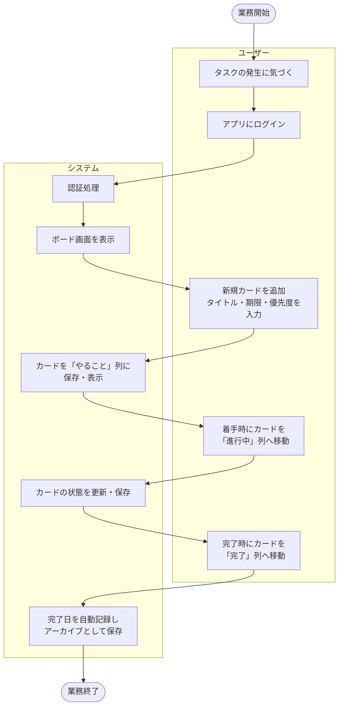

#### 4.2.2 任意の付随作業（履歴確認）

メイン業務サイクルの終了後、必要に応じて実施する任意の作業。
過去に完了したタスクの事実を後から思い出す／確認するために行う。

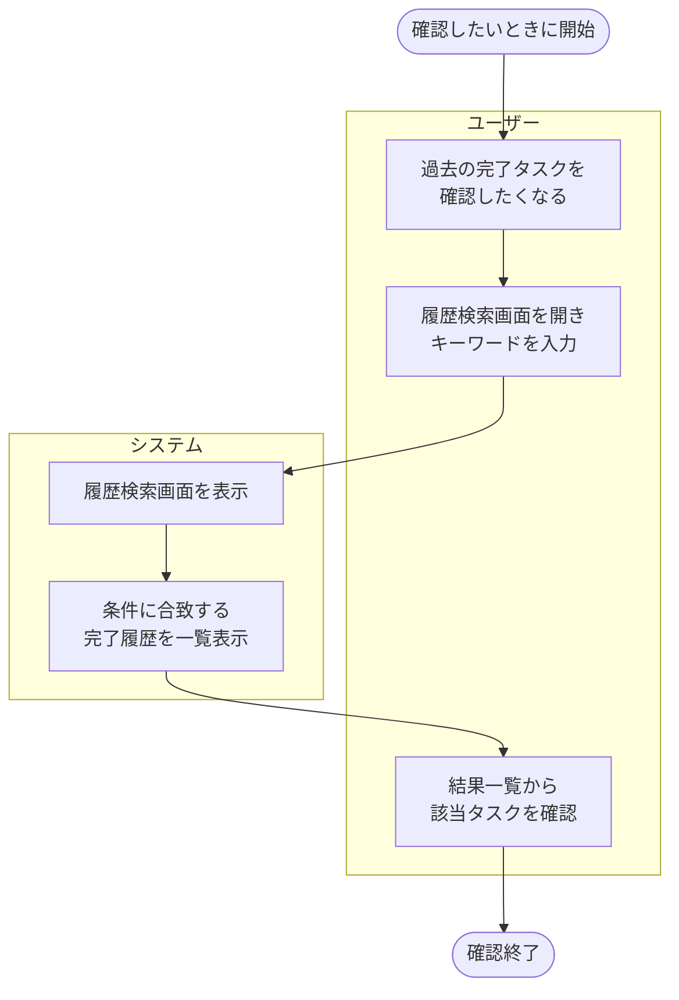

### 4.3 ユースケース図

業務単位で「誰が何をするか」を示す図。Mermaidには正式なユースケース図記法がないため、`flowchart` でアクター（楕円）とユースケース（矩形）、システム境界（subgraph）を擬似的に表現する。

#### 4.3.1 フェーズ1〜4（個人利用）

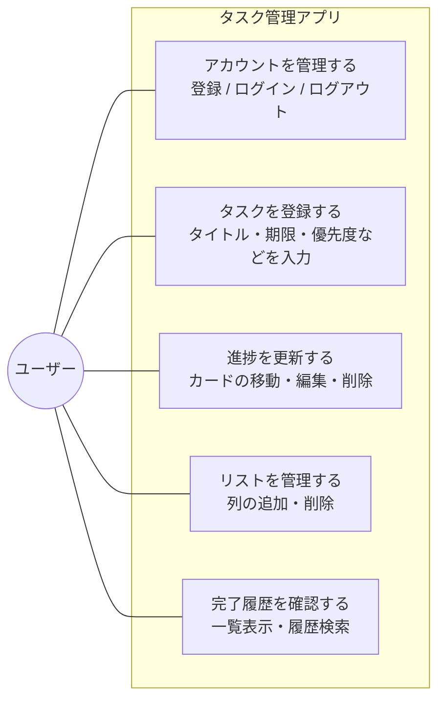

**補足：**
- フェーズ1〜2では「アカウントを管理する」（UC1）は対象外。ブラウザ上で直接タスク管理を行う
- フェーズ3で UC1 が追加される
- フェーズ4で UC5「完了履歴を確認する」のうち履歴検索機能が利用可能になる

#### 4.3.2 フェーズ5（基本機能：ボード／グループ機能を含む）

フェーズ5では「グループメンバー」「グループリーダー」がアクターとして加わる。グループリーダーはグループメンバーを兼ねる関係（Leader is-a Member）にある。

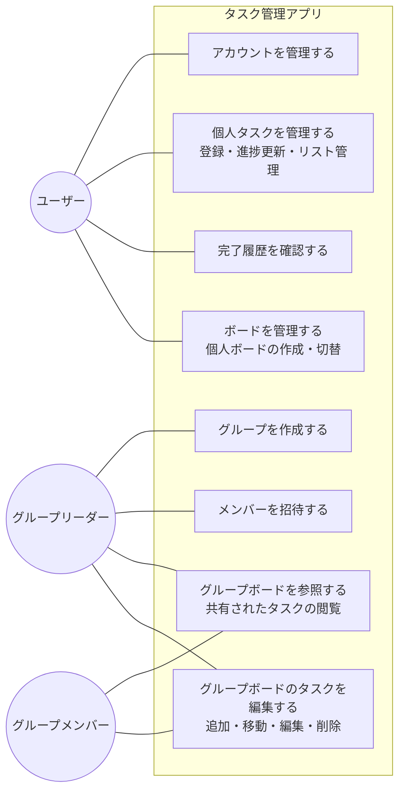

**補足：**
- ユーザー（U）はログイン直後の基本アクター。グループに参加すると「グループメンバー（M）」として、グループを作成すると「グループリーダー（L）」として振る舞う
- グループの作成・メンバー招待はリーダーのみが実行できる
- グループボードの参照・編集はメンバー／リーダーいずれも実行できる（編集権限の細分化は将来検討事項）

### 4.4 ユースケース記述

ユースケース図に登場した各ユースケースを、標準形式（ユースケース名／アクター／概要／事前条件／事後条件／基本フロー／代替フロー）で記述する。

#### UC-01 アカウントを管理する（フェーズ3〜）

| 項目 | 内容 |
|------|------|
| アクター | ユーザー |
| 概要 | メールアドレスとパスワードでアカウントを登録し、ログイン／ログアウトを行う |
| 事前条件 | アプリにアクセスできる |
| 事後条件 | ログイン状態でボード画面が表示される、または未ログイン状態に戻る |

**基本フロー（新規登録 → ログイン → ログアウト）**
1. ユーザーがログイン画面（S-04）を開く
2. 「新規登録はこちら」リンクからユーザー登録画面（S-03）へ遷移
3. メールアドレス・パスワード・パスワード（確認）を入力し「登録」ボタンを押す
4. システムが入力内容を検証し、ユーザーを登録、ログイン画面へ戻す
5. ユーザーがメールアドレスとパスワードを入力し「ログイン」ボタンを押す
6. システムが認証し、ボード画面（S-01）を表示する
7. ヘッダーの「ログアウト」ボタンを押すとセッションを終了し、ログイン画面に戻る

**代替フロー**
- A1. メールアドレスが既に登録されている：エラーを表示し、再入力を促す
- A2. パスワード（確認）が一致しない：エラーを表示し、再入力を促す
- A3. ログイン情報が誤っている：認証エラーを表示し、再入力を促す

---

#### UC-02 タスクを登録する（フェーズ1〜）

| 項目 | 内容 |
|------|------|
| アクター | ユーザー |
| 概要 | 新しいタスクをカードとして「やること」列に追加する |
| 事前条件 | ボード画面が表示されている（フェーズ3以降はログイン済み） |
| 事後条件 | 「やること」列に新規カードが追加されている |

**基本フロー**
1. ユーザーが「やること」列の「+ カード追加」ボタンを押す
2. カード詳細モーダル（S-02）が開く
3. ユーザーがタイトル（必須）、説明文・期限・優先度（任意）を入力する
4. 「保存」ボタンを押す
5. システムがカードを保存し、モーダルを閉じる
6. 「やること」列の末尾に新規カードが表示される

**代替フロー**
- A1. タイトル未入力で保存：必須エラーを表示し、保存しない
- A2. 「キャンセル」または × ボタンで閉じる：保存せずモーダルを閉じる

---

#### UC-03 進捗を更新する（フェーズ1〜）

| 項目 | 内容 |
|------|------|
| アクター | ユーザー |
| 概要 | カードの状態（列）を移動したり、内容を編集したり、不要なカードを削除する |
| 事前条件 | ボード画面に対象カードが表示されている |
| 事後条件 | カードの状態・内容が更新されている、または削除（アーカイブ）されている |

**基本フロー（移動）**
1. ユーザーがカードをドラッグして別の列にドロップする（フェーズ2〜）
2. システムがカードの状態を更新する
3. 「完了」列にドロップした場合、システムが完了日時を自動記録する

**基本フロー（編集）**
1. ユーザーがカードをクリックする
2. カード詳細モーダル（S-02）が開き、現在の内容が表示される
3. ユーザーが内容を編集して「保存」ボタンを押す
4. システムが内容を更新し、モーダルを閉じる

**基本フロー（削除）**
1. ユーザーがカード詳細モーダルで「削除」ボタンを押す
2. システムが確認ダイアログを表示する
3. ユーザーが確認すると、カードはアーカイブ済み（archived=true）として保存され、ボード画面から非表示になる

**代替フロー**
- A1. ドラッグ&ドロップ未対応のフェーズ1：状態変更ボタン等の代替UIを使用する
- A2. 編集中に「キャンセル」：変更を破棄してモーダルを閉じる
- A3. 削除確認でキャンセル：削除を取りやめる

---

#### UC-04 リストを管理する（フェーズ2〜）

| 項目 | 内容 |
|------|------|
| アクター | ユーザー |
| 概要 | カンバンの列（リスト）を任意に追加・削除する |
| 事前条件 | ボード画面が表示されている |
| 事後条件 | リストが追加または削除されている |

**基本フロー（追加）**
1. ユーザーがフッターの「+ リスト追加」ボタンを押す
2. リスト名を入力するダイアログが表示される
3. ユーザーがリスト名を入力して確定する
4. システムが新しいリストを末尾に追加する

**基本フロー（削除）**
1. ユーザーがリストヘッダーの削除アイコンを押す
2. システムが確認ダイアログを表示する（含まれるカードがある場合は警告）
3. ユーザーが確認するとリストが削除される

**代替フロー**
- A1. 削除しようとしたリストにカードが残っている：警告を表示し、カードの扱い（一括削除／別リストへ移動）を選ばせる
- A2. リスト名未入力：必須エラーを表示する

---

#### UC-05 完了履歴を確認する（フェーズ4〜）

| 項目 | 内容 |
|------|------|
| アクター | ユーザー |
| 概要 | 過去に完了したタスクを一覧で確認し、必要に応じて履歴検索で絞り込む |
| 事前条件 | ボード画面が表示されている |
| 事後条件 | 完了タスク一覧が表示される（必要に応じて検索結果に絞り込まれている） |

**基本フロー**
1. ユーザーがボード画面フッターの「完了タスク一覧へ」ボタンを押す
2. 完了タスク一覧画面（S-05）が表示される
3. システムが完了タスクを完了日が新しい順で一覧表示する（タイトル／完了日／説明文先頭1〜2行）
4. ユーザーが必要に応じて履歴検索エリアにキーワード（タイトル／説明文）を入力し、「検索」ボタンを押す
5. システムが AND 条件で絞り込んだ結果を一覧に表示する
6. ユーザーが任意の行をクリックすると、カード詳細モーダル（S-02）で全文を確認できる
7. フッターの「戻る」ボタンでボード画面に戻る

**代替フロー**
- A1. 完了タスクが0件：「完了タスクはありません」と表示する
- A2. 検索結果が0件：「該当するタスクはありません」と表示する

---

#### UC-06 ボードを管理する（フェーズ5）

| 項目 | 内容 |
|------|------|
| アクター | ユーザー |
| 概要 | 個人ボードまたはグループボードを作成し、表示するボードを切り替える |
| 事前条件 | ログイン済み |
| 事後条件 | 選択したボードが表示されている |

**基本フロー**
1. ユーザーがボード切替UI（メニュー等）から「新規ボード作成」を選ぶ
2. ボード名と種別（個人／グループ）を入力する
3. グループを選択した場合、対象グループを指定する
4. システムが新しいボードを作成し、所有者（ユーザーまたはグループ）を設定する
5. 作成されたボードに切り替わって表示される

**代替フロー**
- A1. ボード名未入力：必須エラーを表示する
- A2. グループ未所属でグループボード作成を試行：先にグループ作成が必要である旨のエラーを表示する

---

#### UC-07 グループを作成する（フェーズ5）

| 項目 | 内容 |
|------|------|
| アクター | グループリーダー（作成時点でリーダーになるユーザー） |
| 概要 | 複数ユーザーでボードを共有するためのグループを作成する |
| 事前条件 | ログイン済み |
| 事後条件 | 新しいグループが作成され、作成者がリーダーとして登録されている |

**基本フロー**
1. ユーザーがグループ管理画面（S-06）を開く
2. 「新規グループ作成」ボタンを押す
3. グループ名を入力する
4. システムがグループを作成し、作成者を `owner_user_id` として登録する
5. 作成者が自動的にグループメンバーとして登録される

**代替フロー**
- A1. グループ名未入力：必須エラーを表示する
- A2. 同名グループが既に存在する場合：警告を表示するが作成は許可する（運用上はユニーク制約を設けない想定）

---

#### UC-08 メンバーを招待する（フェーズ5）

| 項目 | 内容 |
|------|------|
| アクター | グループリーダー |
| 概要 | 既存ユーザーをグループメンバーとして招待する |
| 事前条件 | リーダーがそのグループを所有している |
| 事後条件 | 招待されたユーザーがグループメンバーとして登録されている |

**基本フロー**
1. リーダーがグループ管理画面で対象グループを開く
2. 「メンバーを招待」ボタンを押す
3. 招待したいユーザーのメールアドレスを入力する
4. システムが該当ユーザーを検索し、グループメンバーとして登録する
5. 招待されたユーザーは次回ログイン時にグループボードを参照できるようになる

**代替フロー**
- A1. 入力したメールアドレスのユーザーが存在しない：エラーを表示する
- A2. 既にメンバーである：「すでにメンバーです」と表示する

---

#### UC-09 グループボードを参照する（フェーズ5）

| 項目 | 内容 |
|------|------|
| アクター | グループメンバー、グループリーダー |
| 概要 | 自分が所属するグループのボードを表示し、共有されているタスクを閲覧する |
| 事前条件 | グループに所属している |
| 事後条件 | グループボードのカード一覧が表示される |

**基本フロー**
1. ユーザーがボード切替UIから所属するグループのボードを選ぶ
2. システムが該当ボードのリスト・カードを取得して表示する
3. ユーザーがカードをクリックすると、詳細モーダル（S-02）で内容を確認できる

**代替フロー**
- A1. グループから既に外されている：「ボードへのアクセス権がありません」と表示する

---

#### UC-10 グループボードのタスクを編集する（フェーズ5）

| 項目 | 内容 |
|------|------|
| アクター | グループメンバー、グループリーダー |
| 概要 | グループボード上のカードを追加・移動・編集・削除する |
| 事前条件 | グループメンバーとしてグループボードを開いている |
| 事後条件 | グループボードのカード状態が更新されている |

**基本フロー**
1. メンバーが UC-02（タスク登録）／UC-03（進捗更新）と同様の操作を行う
2. システムは変更を該当グループボードに対して保存する
3. 同じグループの他メンバーが次回参照したときに、変更が反映された状態で表示される

**代替フロー**
- A1. 編集権限の細分化（リーダーのみ編集可など）は将来検討事項（5.5.1 参照）であり、現スコープでは全メンバーに編集を許可する
- A2. 同時編集による競合：最終保存が優先される（楽観的ロック方式は将来検討事項）

### 4.5 補足
- フェーズ1〜2では「ログイン」を伴わず、ブラウザ上で直接ボード画面に到達する
- フェーズ5（将来）では、上記フローに加えて「グループメンバーへ共有」「他メンバーが編集」というステップが追加される

---

## 5. 機能要件

### 5.1 フェーズ1: MVP（最小限の機能）
| ID | 機能名 | 概要 |
|----|--------|------|
| F-01 | カード追加 | タスクをカードとして追加できる |
| F-02 | カード表示 | 追加したカードが画面上に表示される |
| F-03 | カード移動 | 「やること」「進行中」「完了」の列間を移動できる |
| F-04 | カード削除 | 不要になったカードを削除できる |

### 5.2 フェーズ2: 基本機能の拡張
| ID | 機能名 | 概要 |
|----|--------|------|
| F-05 | カードタイトル編集 | カードのタイトルを後から変更できる |
| F-06 | カード説明文 | カードに詳細な説明文を追加できる |
| F-07 | 期限設定 | カードに期限（日付）を設定できる |
| F-08 | データ保存 | ブラウザを閉じてもデータが残る |
| F-09 | ドラッグ&ドロップ | カードをマウス操作で移動できる |
| F-10 | リスト追加・削除 | 列（リスト）を任意に追加・削除できる |
| F-11 | 完了タスクのアーカイブ | 「完了」列に移動した時点で完了日を記録し、削除しても履歴データとして保存される |

### 5.3 フェーズ3: ユーザー機能
| ID | 機能名 | 概要 |
|----|--------|------|
| F-12 | ユーザー登録 | メールアドレスとパスワードで新規登録できる |
| F-13 | ログイン | 登録済みユーザーがログインできる |
| F-14 | ログアウト | ログイン中のユーザーがログアウトできる |

### 5.4 フェーズ4: 便利機能の追加
| ID | 機能名 | 概要 |
|----|--------|------|
| F-15 | 優先度設定 | カードに優先度（高・中・低）を設定できる |
| F-16 | 並び替え | カードを期限・優先度・タイトル順で並び替えできる |
| F-17 | 期限警告色 | 期限が近づくにつれカードの色が段階的に赤くなる |
| F-18 | 履歴検索 | 過去の完了タスクをタイトルと説明文のAND条件で検索できる |

### 5.5 フェーズ5: 将来の拡張（基本機能のみ）

フェーズ5では「ボード」概念を導入し、個人ボードとグループボードを共存させる。
個人利用と共有利用を明確に分離するため、LIST はユーザーではなくボードに紐付く構造へ変更する（フェーズ4からの構造変更が伴う）。

| ID | 機能名 | 概要 |
|----|--------|------|
| F-19 | ボード作成 | 個人ボード／グループボードを作成できる |
| F-20 | グループ作成 | 複数ユーザーでボードを共有するグループを作成できる |
| F-21 | メンバー招待 | グループに他ユーザーを招待できる |
| F-22 | ボード共有 | グループに紐付くボード上でカードを共有・編集できる |

#### 5.5.1 将来検討事項（フェーズ5以降の拡張アイデア）

下記はフェーズ5の基本機能の上に積み上げることを想定した検討事項であり、本要件定義の正式スコープには含めない。

| 項目 | 概要 |
|------|------|
| 担当者割当・進捗の可視化 | カードに担当者（assignee）を設定し、誰がどのタスクを受け持っているか・完了しているかを一覧で確認できるようにする |
| リーダー権限・認可ロジック | グループにリーダー（owner）役割を設け、追加・削除・編集・催促などの管理操作はリーダーのみ可能にする。タスク移動は担当者またはリーダーのみ可能とする |
| タスク提案フロー | リーダー以外のメンバーがタスクを提案でき、リーダーが承認するとタスク化される。提案には提案者情報を含める |
| 通知機能 | 提案・催促・割当などのイベントをユーザーに通知する仕組み |

### 5.6 各機能のIPO（入力／処理／出力）

各機能要件に対し「何を入力として受け取り」「どう処理し」「何を出力するか」を一覧で示す。
関連ユースケース欄は 4.4 の UC-XX を参照する。

#### 5.6.1 フェーズ1〜2（MVP〜基本機能拡張）

| ID | 機能名 | 入力 | 処理 | 出力 | 関連UC |
|----|--------|------|------|------|--------|
| F-01 | カード追加 | タイトル（必須） | 入力検証 → 新規カードを「やること」列に追加 | 「やること」列にカード表示 | UC-02 |
| F-02 | カード表示 | （画面読み込み） | 保存済みカードを取得 | カードを所属列ごとに描画 | UC-02, UC-03 |
| F-03 | カード移動 | カードID、移動先列 | カードの状態（status）を更新 | 移動後のボード状態を再描画 | UC-03 |
| F-04 | カード削除 | カードID | アーカイブ済みフラグ（archived=true）を設定 | カードがボードから非表示になる | UC-03 |
| F-05 | カードタイトル編集 | カードID、新タイトル | 入力検証 → タイトルを更新 | 編集後のカード表示 | UC-03 |
| F-06 | カード説明文 | カードID、説明文 | 説明文を保存 | カード詳細に説明文を表示 | UC-02, UC-03 |
| F-07 | 期限設定 | カードID、期限（日付） | 期限を保存 | カードに期限を表示 | UC-02, UC-03 |
| F-08 | データ保存 | （任意の更新操作） | localStorage（フェーズ1〜2）または DB（フェーズ3〜）へ書き込み | データの永続化 | 全UC |
| F-09 | ドラッグ&ドロップ | カードの掴み・離し位置 | 列・位置情報を更新 | カードが新しい位置に配置 | UC-03 |
| F-10 | リスト追加・削除 | リスト名（追加時）／リストID（削除時） | リストを追加または削除 | 列が追加／削除されたボード | UC-04 |
| F-11 | 完了タスクのアーカイブ | カードID（完了列へ移動） | 完了日時を記録、archived は保持 | 履歴データとして保存される | UC-03, UC-05 |

#### 5.6.2 フェーズ3（ユーザー機能）

| ID | 機能名 | 入力 | 処理 | 出力 | 関連UC |
|----|--------|------|------|------|--------|
| F-12 | ユーザー登録 | メール、パスワード、パスワード確認 | 入力検証 → パスワードをハッシュ化 → ユーザー保存 | 登録完了 → ログイン画面へ | UC-01 |
| F-13 | ログイン | メール、パスワード | 認証（ハッシュ照合） → セッション開始 | ボード画面表示 | UC-01 |
| F-14 | ログアウト | （ボタン押下） | セッション終了 | ログイン画面へ遷移 | UC-01 |

#### 5.6.3 フェーズ4（便利機能の追加）

| ID | 機能名 | 入力 | 処理 | 出力 | 関連UC |
|----|--------|------|------|------|--------|
| F-15 | 優先度設定 | カードID、優先度（高／中／低） | 優先度を保存 | カードに優先度ラベルを表示 | UC-02, UC-03 |
| F-16 | 並び替え | 並び替え基準（期限／優先度／タイトル） | 指定基準でソート | 並び替え後のカード順序 | UC-03 |
| F-17 | 期限警告色 | （画面描画時のカード情報） | 期限と現在日付の差分を計算 → 色階調を決定 | カード背景色が段階的に変化 | UC-02, UC-03 |
| F-18 | 履歴検索 | タイトルキーワード、説明文キーワード | タイトル・説明文の AND 条件で絞り込み | 検索結果を一覧表示 | UC-05 |

#### 5.6.4 フェーズ5（ボード／グループ機能）

| ID | 機能名 | 入力 | 処理 | 出力 | 関連UC |
|----|--------|------|------|------|--------|
| F-19 | ボード作成 | ボード名、種別（個人／グループ）、対象グループID（グループの場合） | 入力検証 → ボードを作成、所有者を設定 | 作成されたボードに切替表示 | UC-06 |
| F-20 | グループ作成 | グループ名 | グループを作成、作成者をリーダーかつメンバーとして登録 | 新しいグループが一覧に追加 | UC-07 |
| F-21 | メンバー招待 | 招待対象のメールアドレス | ユーザーを検索 → GROUP_MEMBER に追加 | グループメンバーに追加 | UC-08 |
| F-22 | ボード共有 | グループボード上のカード操作 | グループボードに対して保存 | 同グループの他メンバーに反映 | UC-09, UC-10 |

### 5.7 入力チェック仕様

各画面の入力項目に対するバリデーションルールとエラー表示内容を整理する。
エラーメッセージはこの表で確定し、エラーメッセージ一覧は別途まとめて参照可能とする。

#### 5.7.1 S-02 カード詳細モーダル

| 項目 | 必須 | 形式・制約 | エラーメッセージ |
|------|------|----------|-----------------|
| タイトル | ○ | 1〜100文字 | 「タイトルを入力してください」「タイトルは100文字以内で入力してください」 |
| 説明文 | × | 0〜2000文字 | 「説明文は2000文字以内で入力してください」 |
| 期限 | × | 有効な日付形式（YYYY-MM-DD）。過去日付も許可 | 「正しい日付形式で入力してください」 |
| 優先度 | × | 選択肢（高／中／低）のみ | （UI上は選択肢制限のため発生しない想定） |

#### 5.7.2 S-03 ユーザー登録画面

| 項目 | 必須 | 形式・制約 | エラーメッセージ |
|------|------|----------|-----------------|
| メールアドレス | ○ | メール形式（例：`example@example.com`）、最大256文字、システム内でユニーク | 「メールアドレスを入力してください」「メールアドレスの形式が正しくありません」「このメールアドレスは既に登録されています」 |
| パスワード | ○ | 8〜64文字、半角英字・数字を最低1文字ずつ含む | 「パスワードを入力してください」「パスワードは8文字以上64文字以内で入力してください」「パスワードは英字と数字を含めてください」 |
| パスワード（確認） | ○ | パスワードと完全一致 | 「確認用パスワードを入力してください」「パスワードが一致しません」 |

#### 5.7.3 S-04 ログイン画面

| 項目 | 必須 | 形式・制約 | エラーメッセージ |
|------|------|----------|-----------------|
| メールアドレス | ○ | メール形式 | 「メールアドレスを入力してください」「メールアドレスの形式が正しくありません」 |
| パスワード | ○ | 1文字以上 | 「パスワードを入力してください」 |
| 認証結果 | ― | 認証成功 | 失敗時：「メールアドレスまたはパスワードが正しくありません」 |

#### 5.7.4 S-01 ボード画面（リスト追加ダイアログ）

| 項目 | 必須 | 形式・制約 | エラーメッセージ |
|------|------|----------|-----------------|
| リスト名 | ○ | 1〜30文字 | 「リスト名を入力してください」「リスト名は30文字以内で入力してください」 |

#### 5.7.5 S-05 完了タスク一覧画面（履歴検索エリア）

| 項目 | 必須 | 形式・制約 | エラーメッセージ |
|------|------|----------|-----------------|
| タイトル検索キーワード | × | 0〜50文字 | 「検索キーワードは50文字以内で入力してください」 |
| 説明文検索キーワード | × | 0〜50文字 | 「検索キーワードは50文字以内で入力してください」 |

※ 両方とも空欄の場合は全件表示（エラーにしない）。

#### 5.7.6 S-06 グループ管理画面（フェーズ5）

| 項目 | 必須 | 形式・制約 | エラーメッセージ |
|------|------|----------|-----------------|
| グループ名 | ○ | 1〜50文字 | 「グループ名を入力してください」「グループ名は50文字以内で入力してください」 |
| 招待メールアドレス | ○ | メール形式、登録済みユーザーであること | 「メールアドレスを入力してください」「該当するユーザーが見つかりません」「このユーザーは既にメンバーです」 |
| ボード名 | ○ | 1〜50文字 | 「ボード名を入力してください」「ボード名は50文字以内で入力してください」 |
| ボード種別 | ○ | 「個人」または「グループ」 | （UI上は選択肢制限のため発生しない想定） |
| 対象グループ（グループボード作成時のみ） | ○ | ユーザーが所属するグループ | 「グループを選択してください」 |

#### 5.7.7 共通方針

- 入力チェックは **クライアント側（即時フィードバック）とサーバー側（最終検証）の両方で実施** する（フェーズ3以降）
- フェーズ1〜2はクライアント側のみで実施（バックエンドが存在しないため）
- 必須項目が未入力の場合、保存ボタンは押下できない（または押下時にエラー表示）
- エラーメッセージは該当入力欄の直下に赤字で表示する

### 5.8 エラーメッセージ一覧

5.7 で挙げた入力チェックメッセージと、システム動作上発生しうるエラー・情報メッセージをコード付きで一覧化する。
重要度区分：**E**（エラー：処理中断）／ **W**（警告：継続可能）／ **I**（情報：通知のみ）

#### 5.8.1 入力チェック系（E-001〜E-099）

| コード | メッセージ | 対象画面 | 発生条件 | 重要度 |
|-------|-----------|---------|---------|-------|
| E-001 | タイトルを入力してください | S-02 | カード保存時にタイトルが未入力 | E |
| E-002 | タイトルは100文字以内で入力してください | S-02 | タイトルが100文字超過 | E |
| E-003 | 説明文は2000文字以内で入力してください | S-02 | 説明文が2000文字超過 | E |
| E-004 | 正しい日付形式で入力してください | S-02 | 期限が無効な日付形式 | E |
| E-005 | メールアドレスを入力してください | S-03, S-04, S-06 | メールアドレスが未入力 | E |
| E-006 | メールアドレスの形式が正しくありません | S-03, S-04, S-06 | メール形式チェック失敗 | E |
| E-007 | パスワードを入力してください | S-03, S-04 | パスワードが未入力 | E |
| E-008 | パスワードは8文字以上64文字以内で入力してください | S-03 | パスワード長範囲外 | E |
| E-009 | パスワードは英字と数字を含めてください | S-03 | パスワード構成チェック失敗 | E |
| E-010 | 確認用パスワードを入力してください | S-03 | パスワード（確認）が未入力 | E |
| E-011 | パスワードが一致しません | S-03 | パスワードと確認用が不一致 | E |
| E-012 | リスト名を入力してください | S-01 | リスト追加で未入力 | E |
| E-013 | リスト名は30文字以内で入力してください | S-01 | リスト名が30文字超過 | E |
| E-014 | 検索キーワードは50文字以内で入力してください | S-05 | 検索キーワードが50文字超過 | E |
| E-015 | グループ名を入力してください | S-06 | グループ作成で未入力 | E |
| E-016 | グループ名は50文字以内で入力してください | S-06 | グループ名が50文字超過 | E |
| E-017 | ボード名を入力してください | S-06 | ボード作成で未入力 | E |
| E-018 | ボード名は50文字以内で入力してください | S-06 | ボード名が50文字超過 | E |
| E-019 | グループを選択してください | S-06 | グループボード作成でグループ未選択 | E |

#### 5.8.2 認証・業務系（E-100〜E-199）

| コード | メッセージ | 対象画面 | 発生条件 | 重要度 |
|-------|-----------|---------|---------|-------|
| E-101 | このメールアドレスは既に登録されています | S-03 | 登録時にメールアドレスが重複 | E |
| E-102 | メールアドレスまたはパスワードが正しくありません | S-04 | 認証失敗 | E |
| E-103 | セッションの有効期限が切れました。再度ログインしてください | 全画面 | セッションタイムアウト時 | E |
| E-104 | 該当するユーザーが見つかりません | S-06 | 招待時に対象ユーザーが未登録 | E |
| E-105 | このユーザーは既にメンバーです | S-06 | 招待時に既にメンバー | W |
| E-106 | ボードへのアクセス権がありません | S-01（グループボード） | グループから外された後にアクセス | E |
| E-107 | この操作を行う権限がありません | S-01, S-06 | リーダー専用操作を非リーダーが実行 | E |

#### 5.8.3 システム系（E-300〜E-399）

| コード | メッセージ | 対象画面 | 発生条件 | 重要度 |
|-------|-----------|---------|---------|-------|
| E-301 | 通信に失敗しました。ネットワーク接続を確認してください | 全画面 | サーバー通信エラー | E |
| E-302 | データの保存に失敗しました。時間をおいて再度お試しください | 全画面 | 保存処理失敗 | E |
| E-303 | データの取得に失敗しました | 全画面 | 取得処理失敗 | E |
| E-304 | 予期しないエラーが発生しました | 全画面 | 想定外の例外 | E |

#### 5.8.4 情報・警告メッセージ（I-001〜）

| コード | メッセージ | 対象画面 | 発生条件 | 重要度 |
|-------|-----------|---------|---------|-------|
| I-001 | 完了タスクはありません | S-05 | 完了タスクが0件 | I |
| I-002 | 該当するタスクはありません | S-05 | 検索結果が0件 | I |
| I-003 | このカードを削除してもよろしいですか？ | S-02 | カード削除時の確認 | I |
| I-004 | このリストを削除してもよろしいですか？（含まれるカードも非表示になります） | S-01 | リスト削除時の確認 | W |

#### 5.8.5 表示方針

- **入力チェック系（E-0xx）**：該当入力欄の直下に赤字で表示（即時フィードバック）
- **認証・業務系（E-1xx）**：画面上部のアラート領域、または該当操作直近にトースト等で表示
- **システム系（E-3xx）**：画面中央のモーダルまたはトーストで表示
- **情報・警告系（I-0xx）**：確認ダイアログまたはエンプティステート表示として実装

---

## 6. 非機能要件

IPA「非機能要求グレード」の6大項目（可用性／性能・拡張性／運用・保守性／移行性／セキュリティ／システム環境）に準拠して整理する。
学習用プロジェクトのため、現実的かつ妥当な目標値を設定し、運用上の制約は最小限とする。

### 6.1 可用性

| 項目 | 内容 |
|------|------|
| サービス提供時間 | 24時間（ベストエフォート） |
| 稼働率目標 | 月間 99%（学習用想定） |
| 計画停止 | 月1回以内、事前告知のうえ実施 |
| 目標復旧時間（RTO） | 障害発生から4時間以内に復旧 |
| 目標復旧時点（RPO） | 障害発生時点から24時間以内のデータまで保証 |
| 障害時対応 | バックアップからリストア、エラー画面表示 |

### 6.2 性能・拡張性

| 項目 | 内容 |
|------|------|
| 主要画面の表示時間 | 3秒以内（ボード画面・カード詳細・履歴一覧） |
| カード移動・編集の応答時間 | 1秒以内 |
| 想定同時接続ユーザー数 | フェーズ1〜4：100ユーザー／フェーズ5：500ユーザー |
| 1ユーザーあたりのカード件数 | 1,000件まで快適に動作 |
| 履歴検索の応答時間 | 検索結果1,000件以下で3秒以内 |
| 将来の拡張性 | アプリケーションサーバはスケールアウト可能な構成を前提（フェーズ5以降検討） |

### 6.3 運用・保守性

| 項目 | 内容 |
|------|------|
| ログ保管期間 | アプリログ：30日、エラーログ：90日 |
| バックアップ方式 | 日次フルバックアップ、世代管理7世代 |
| 監視 | 死活監視、エラーログ通知（学習用は簡易な仕組みで可） |
| デプロイ方法 | GitHub から自動デプロイ（将来 CI/CD 導入） |
| 保守ドキュメント | README、環境構築手順書、操作マニュアル |
| バージョン管理 | Git／GitHub によるソースコード管理 |

### 6.4 移行性

| 項目 | 内容 |
|------|------|
| 既存システムからのデータ移行 | なし（新規構築のため） |
| 初期データ投入 | なし |
| フェーズ間の構造変更 | フェーズ4→フェーズ5への移行時、各ユーザーに個人ボードを自動生成し、既存リストを当該ボードに紐付ける移行スクリプトを用意 |
| データエクスポート | フェーズ4以降、JSON形式での自ユーザーデータエクスポートを将来検討 |

### 6.5 セキュリティ

| 項目 | 内容 |
|------|------|
| 通信暗号化 | フェーズ3以降は HTTPS 必須（TLS 1.2 以上） |
| パスワード保管 | 平文保存禁止。bcrypt 等の一方向ハッシュで保管、ソルト付与 |
| 認証方式 | メールアドレス＋パスワード認証 |
| セッション管理 | セッション有効期限24時間、HttpOnly Cookie、Secure属性付与 |
| ログイン試行制限 | 連続5回失敗で当該アカウントを15分間ロック |
| XSS対策 | 入力値のエスケープ、出力時のサニタイズ |
| CSRF対策 | リクエストにCSRFトークンを付与し検証 |
| SQLインジェクション対策 | プリペアドステートメント／ORM の使用 |
| 認可 | ログインユーザーは自身のデータ／所属グループのデータのみ参照・編集可能 |
| ログイン情報の取り扱い | 他ユーザーから参照できないこと |

### 6.6 システム環境

| 項目 | 内容 |
|------|------|
| 対応ブラウザ | Google Chrome（最新版）／ Microsoft Edge（最新版） |
| 対応OS | Windows 10／Windows 11／macOS（直近2バージョン） |
| 推奨解像度 | 1280×720 以上 |
| 対応デバイス | PC（デスクトップ・ノート）を主対象。スマートフォン対応は将来検討 |
| サーバ環境（フェーズ3〜） | 未定（クラウド：Heroku／AWS／Vercel など、スクール教材に合わせる） |
| データベース（フェーズ3〜） | 未定（PostgreSQL／MySQL など） |

### 6.7 ユーザビリティ

| 項目 | 内容 |
|------|------|
| 学習容易性 | 初見ユーザーがマニュアルなしで主要操作（カード追加・移動・完了）を1分以内に実施できる |
| UI方針 | Trello風カンバンを採用し、視覚的・直感的な操作を重視 |
| 言語対応 | 日本語のみ（多言語対応は将来検討） |
| アクセシビリティ | キーボード操作で主要機能にアクセスできる（簡易対応。WAI-ARIA等の本格対応は将来検討） |
| エラー時のフィードバック | エラー発生時はユーザーが原因と次の行動が判断できる文言で表示（5.8 エラーメッセージ一覧 参照） |

---

## 7. 画面構成

### 7.1 画面一覧

| 画面ID | 画面名 | 概要 | フェーズ |
|--------|--------|------|---------|
| S-01 | ボード画面 | タスクカードを一覧表示する画面 | 1 |
| S-02 | カード詳細画面 | カードの編集・詳細表示画面（ボード画面上にモーダルで重ねて表示） | 2 |
| S-03 | ユーザー登録画面 | 新規登録フォーム | 3 |
| S-04 | ログイン画面 | ログインフォーム | 3 |
| S-05 | 完了タスク一覧画面 | 完了タスクの一覧表示と履歴検索を行う画面 | 4 |
| S-06 | グループ管理画面 | グループの作成・管理画面 | 5 |

### 7.2 画面遷移図

#### 7.2.1 フェーズ1〜4（個人利用）

ログイン画面を起点とし、認証後にボード画面を中心としたタスク管理画面群へ遷移する。

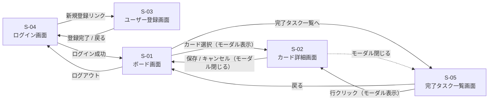

**補足：**
- フェーズ1〜2は認証機能がないため、起点はボード画面（S-01）となり、S-03/S-04 は存在しない
- フェーズ3でログイン・ユーザー登録・ログアウトの遷移が追加される
- フェーズ4で履歴検索画面（S-05）への遷移が追加される

#### 7.2.2 フェーズ5（将来：グループ機能）

フェーズ5ではボード画面からグループ管理画面（S-06）への遷移が追加される。

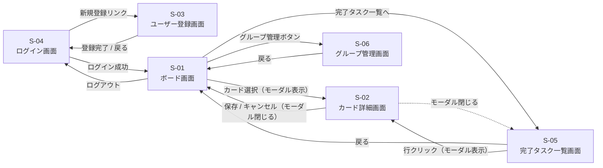

### 7.3 画面ワイヤーフレーム

各画面の要素配置（ブロック構造）を Mermaid で示す。実際のレイアウト（余白・サイズ・色）は別途デザインで決定する。

#### 7.3.1 S-01 ボード画面

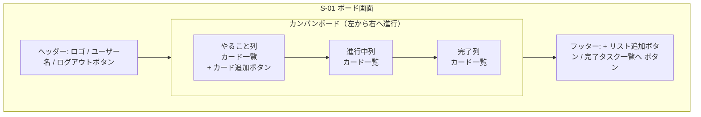

#### 7.3.2 S-02 カード詳細画面（モーダル）

ボード画面のカードをクリックすると、ボード画面の上に重ねてモーダル表示される。背景はオーバーレイで暗くする想定。

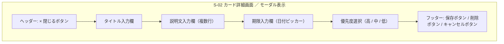

#### 7.3.3 S-03 ユーザー登録画面

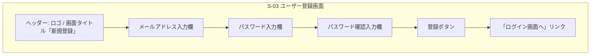

#### 7.3.4 S-04 ログイン画面

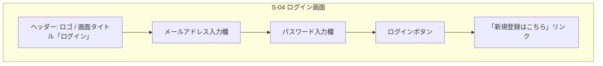

#### 7.3.5 S-05 完了タスク一覧画面

画面を開いた時点では、完了したタスクを **完了日が新しい順（最新順）** で一覧表示する。
画面上部に1行分の履歴検索エリアを配置し、キーワードを入力すると一覧が検索結果に絞り込まれる。
画面の大部分は完了タスク一覧の表示領域として使い、戻るボタンはフッターに配置する。

各タスクは **タイトル・完了日・説明文（先頭1〜2行のみ省略表示）** を一覧に表示する。
直感的に完了タスクの内容が把握できることを目的とし、行をクリックすると S-02 カード詳細画面（モーダル）が開いて説明文の全文を確認できる。

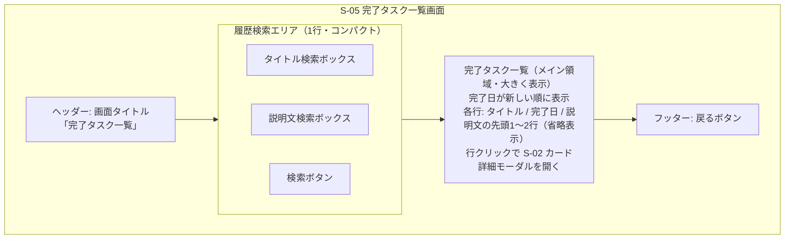

---

## 8. 使用技術（技術スタック）

### 8.1 フェーズ1〜2、4
- **HTML / CSS / JavaScript**（フロントエンドのみ）
- **localStorage**（ブラウザ内データ保存）

### 8.2 フェーズ3以降
- **フロントエンド**: HTML / CSS / JavaScript（または React 等のフレームワーク）
- **バックエンド**: 未定（Ruby on Rails / Node.js などスクール教材に合わせる）
- **データベース**: 未定（PostgreSQL / MySQL など）
- **認証**: メール+パスワード認証

### 8.3 開発・管理ツール
- **バージョン管理**: Git / GitHub
- **エディタ**: Visual Studio Code

---

## 9. データ仕様

### 9.1 データ項目

各エンティティの業務的な属性を記載する。物理的な型・制約の詳細はER図（9.2）を参照。

#### 9.1.1 タスクカード（CARD）

| 項目 | 型 | 必須 | 備考 |
|------|----|----|------|
| ID | 文字列 | ○ | 一意の識別子 |
| タイトル | 文字列 | ○ | カードの見出し |
| 説明文 | 文字列 | × | 詳細メモ |
| 期限 | 日付 | × | 締め切り日 |
| 優先度 | 列挙（高・中・低） | × | 並び替え・表示用 |
| 状態 | 列挙（やること・進行中・完了） | ○ | 所属する列 |
| 完了日 | 日付 | × | 完了列に移動した日付を記録 |
| アーカイブ済み | 真偽値 | ○ | 削除済みかどうか（履歴として残すため削除フラグ方式） |
| 並び順 | 数値 | ○ | リスト内での表示順 |

#### 9.1.2 リスト（LIST）

カンバンの列を表すエンティティ。フェーズ1〜4ではユーザーに紐付き、フェーズ5以降はボードに紐付く。

| 項目 | 型 | 必須 | 備考 |
|------|----|----|------|
| ID | 文字列 | ○ | 一意の識別子 |
| ユーザーID | 数値 | △ | フェーズ3〜4で必須。フェーズ5ではボードIDに置き換わる |
| ボードID | 数値 | △ | フェーズ5以降で必須 |
| 列名 | 文字列 | ○ | 列の表示名（やること／進行中／完了／ユーザー追加列） |
| 並び順 | 数値 | ○ | 左から1, 2, 3... の順序 |

#### 9.1.3 ユーザー（USER）

フェーズ3で導入。

| 項目 | 型 | 必須 | 備考 |
|------|----|----|------|
| ID | 数値 | ○ | 一意の識別子 |
| メールアドレス | 文字列 | ○ | ユニーク。ログインIDとして使用 |
| パスワード（ハッシュ） | 文字列 | ○ | 平文保存しない（ハッシュ化して保存） |
| 作成日時 | 日時 | ○ | アカウント登録日時 |

#### 9.1.4 ボード（BOARD）

フェーズ5で導入。個人ボードまたはグループボードのいずれかとして作成される。

| 項目 | 型 | 必須 | 備考 |
|------|----|----|------|
| ID | 数値 | ○ | 一意の識別子 |
| ボード名 | 文字列 | ○ | ボードの表示名 |
| 所有ユーザーID | 数値 | △ | 個人ボードの場合に設定（グループボードでは空） |
| 所有グループID | 数値 | △ | グループボードの場合に設定（個人ボードでは空） |
| 作成日時 | 日時 | ○ | ボード作成日時 |

※ 所有ユーザーIDと所有グループIDはどちらか一方のみ設定される（排他）

#### 9.1.5 グループ（GROUP）

フェーズ5で導入。

| 項目 | 型 | 必須 | 備考 |
|------|----|----|------|
| ID | 数値 | ○ | 一意の識別子 |
| グループ名 | 文字列 | ○ | グループの表示名 |
| 作成者ユーザーID | 数値 | ○ | グループを作成したユーザー |
| 作成日時 | 日時 | ○ | グループ作成日時 |

#### 9.1.6 グループメンバー（GROUP_MEMBER）

フェーズ5で導入。ユーザーとグループの所属関係（多対多）を表す中間テーブル。

| 項目 | 型 | 必須 | 備考 |
|------|----|----|------|
| ID | 数値 | ○ | 一意の識別子 |
| グループID | 数値 | ○ | 所属先のグループ |
| ユーザーID | 数値 | ○ | 所属するユーザー |
| 参加日時 | 日時 | ○ | グループに参加した日時 |

### 9.2 ER図

#### 9.2.1 フェーズ1〜4（個人利用）

個人利用が前提のため、ユーザーは自分専用のリスト（列）とカードを保有する。

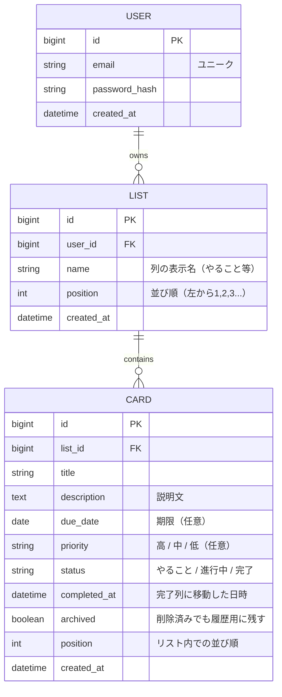

**補足：**
- USER はフェーズ3以降で導入される。フェーズ1〜2では認証を持たないため、LIST と CARD のみがブラウザの localStorage に保存される
- CARD.completed_at は完了タスク一覧画面（S-05）で完了日順ソートと履歴検索の根拠データとなる
- CARD.archived = true のレコードはボード画面には表示されず、完了タスク一覧画面でのみ参照される

#### 9.2.2 フェーズ5（基本機能：ボード概念の導入）

個人用ボードとグループ用ボードを共存させるため、BOARD エンティティを新規導入する。
LIST は USER ではなく BOARD に紐付く形に変更し、BOARD の所有者は個人ユーザーまたはグループのいずれかとする。

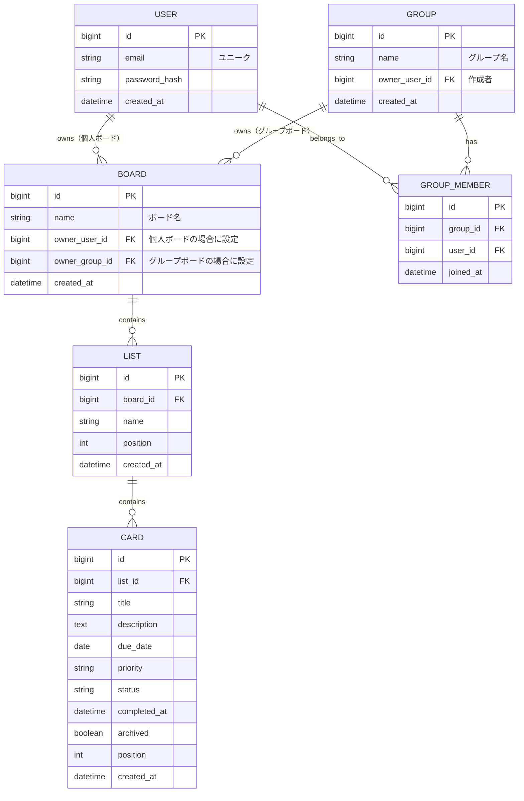

**補足：**
- BOARD.owner_user_id と BOARD.owner_group_id はどちらか一方のみ値を持つ（排他制約）。個人ボードかグループボードかを区別する
- フェーズ4から移行する際は、各ユーザーに「個人ボード」を1つ自動生成し、既存の LIST.user_id を LIST.board_id へ付け替える移行処理が必要となる
- 担当者割当・リーダー権限・提案フロー・通知などは将来検討事項（5.5.1 参照）であり、本ER図には含めていない

---

## 10. 開発スケジュール（目安）

| フェーズ | 内容 | 目安期間 |
|---------|------|---------|
| フェーズ1 | MVP実装 | 1〜2週間 |
| フェーズ2 | 基本機能拡張 | 2〜3週間 |
| フェーズ3 | ユーザー機能（バックエンド学習含む） | 3〜4週間 |
| フェーズ4 | 便利機能追加 | 2週間 |
| フェーズ5 | グループ機能 | 未定 |

---

## 11. 改訂履歴

| 日付 | 版 | 内容 |
|------|----|----|
| 2026-05-05 | 1.0 | 初版作成 |
| 2026-05-06 | 1.1 | プロジェクト体制・前提条件（第2章）を追加、章番号を再採番 |
| 2026-05-07 | 1.2 | 業務要件（第4章）を追加、業務フロー図を Mermaid で記載 |
| 2026-05-07 | 1.3 | 画面遷移図（第7章 7.2）を追加（フェーズ1〜4および将来のフェーズ5） |
| 2026-05-08 | 1.4 | 画面ワイヤーフレーム（第7章 7.3）を追加。S-05を「完了タスク一覧画面」に改称し履歴検索機能を内包。ボード画面フッターに「完了タスク一覧へ」ボタン追加。S-02はモーダル表示に変更。 |
| 2026-05-08 | 1.5 | S-05 完了タスク一覧の各行に説明文の先頭1〜2行を省略表示する仕様を追記。行クリックで S-02 カード詳細モーダルを開く遷移を画面遷移図にも反映。 |
| 2026-05-08 | 1.6 | ER図（第9章 9.2）を追加（フェーズ1〜4／フェーズ5）。フェーズ5は方式A（BOARDエンティティ導入）を採用しスコープを基本機能（5-A）に絞る。担当者・リーダー権限・提案・通知は将来検討事項として 5.5.1 に記載。 |
| 2026-05-08 | 1.7 | データ項目（9.1）を全エンティティ分に拡充（タスクカード／リスト／ユーザー／ボード／グループ／グループメンバー）。 |
| 2026-05-08 | 1.8 | ユースケース図（第4章 4.3）を追加（フェーズ1〜4／フェーズ5）。既存の補足は 4.4 に繰り下げ。 |
| 2026-05-08 | 1.9 | ユースケース記述（第4章 4.4）を追加。UC-01〜UC-10 を標準形式（アクター／事前・事後条件／基本・代替フロー）で記載。既存の補足は 4.5 に繰り下げ。 |
| 2026-05-08 | 1.10 | 各機能のIPO（第5章 5.6）を追加。F-01〜F-22 全機能をフェーズ別の一覧テーブルで「入力／処理／出力／関連UC」として記載。 |
| 2026-05-08 | 1.11 | 入力チェック仕様（第5章 5.7）を追加。S-01〜S-06 の各画面ごとに入力項目・必須・形式・エラーメッセージを記載。クライアント／サーバー両方でのチェック方針も明記。 |
| 2026-05-08 | 1.12 | エラーメッセージ一覧（第5章 5.8）を追加。入力チェック系（E-0xx）、認証・業務系（E-1xx）、システム系（E-3xx）、情報・警告系（I-0xx）をコード付きで一覧化し、表示方針も明記。 |
| 2026-05-08 | 1.13 | 第6章「非機能要件」をIPA非機能要求グレード準拠の7項目構成に全面拡張（可用性／性能・拡張性／運用・保守性／移行性／セキュリティ／システム環境／ユーザビリティ）。学習用想定の妥当な数値目標を設定。 |
